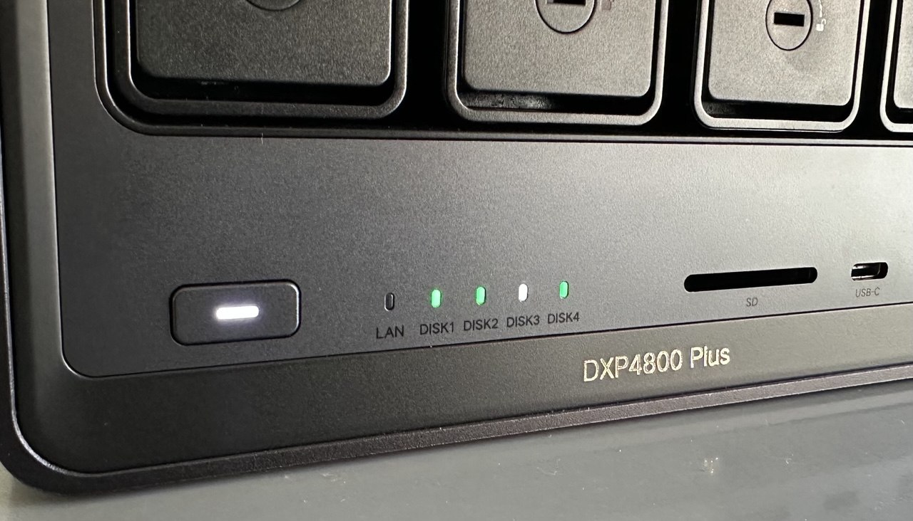

# UGREEN DXP4800 Plus LED Controller for Proxmox 



This repository automates front-panel drive bay LED updates for a **UGREEN DXP4800 Plus** on **Proxmox VE**.

By using **udev rules** and **systemd**, the system updates LED colors immediately when drives are added, removed, or report SMART failures.

## LED Color Logic
- ⚪ **White**: Healthy standalone disk.
- 🟢 **Green**: Healthy disk and active ZFS member.
- 🔴 **Red**: Disk failed SMART health check.
- ⚫ **Off**: Empty bay.

## Files in this repository
- `ugreen_leds_sync.sh` — sync script for disk state and LED color updates
- `ugreen-leds.service` — systemd oneshot service to run the sync script
- `99-ugreen-leds.rules` — udev rule to trigger the service on disk add/remove

## Installation

### 1. Prerequisites
On the Proxmox host, install required packages and enable I2C:

```bash
apt update
apt install i2c-tools smartmontools -y
modprobe i2c-dev
echo "i2c-dev" >> /etc/modules
```

### 2. Install `ugreen_leds_cli`
Download the official CLI binary and make it executable:

```bash
wget https://github.com/miskcoo/ugreen_leds_controller/releases/download/v0.3/ugreen_leds_cli -O /usr/local/bin/ugreen_leds_cli
chmod +x /usr/local/bin/ugreen_leds_cli
```

### 3. Place repository files in the correct paths
Move the repo files to the system locations used by the service and udev:

```bash
install -m 0755 ugreen_leds_sync.sh /usr/local/bin/ugreen_leds_sync.sh
install -m 0644 ugreen-leds.service /etc/systemd/system/ugreen-leds.service
install -m 0644 99-ugreen-leds.rules /etc/udev/rules.d/99-ugreen-leds.rules
```

### 4. Enable and reload
Reload systemd and udev, then enable the service for manual starts by rules:

```bash
systemctl daemon-reload
udevadm control --reload-rules
systemctl enable --now ugreen-leds.service
```

> The udev rule runs `systemctl --no-block start ugreen-leds.service` whenever SCSI block devices (`sd*`) are added or removed.

## How it works
- `99-ugreen-leds.rules` detects disk add/remove events and triggers `ugreen-leds.service`.
- `ugreen-leds.service` waits 5 seconds, then runs `ugreen_leds_sync.sh`.
- `ugreen_leds_sync.sh` checks SMART health and ZFS membership for detected disks, then updates LED state through `ugreen_leds_cli`.

## Troubleshooting
If a newly inserted disk stays white instead of green:
- Wait a few seconds for the service and ZFS to settle.
- Run the sync script manually to verify it works:

```bash
/usr/local/bin/ugreen_leds_sync.sh
```

If manual execution fails, verify:
- `/usr/local/bin/ugreen_leds_cli` exists and is executable
- `ugreen-leds.service` is installed in `/etc/systemd/system/`
- `99-ugreen-leds.rules` is installed in `/etc/udev/rules.d/`

